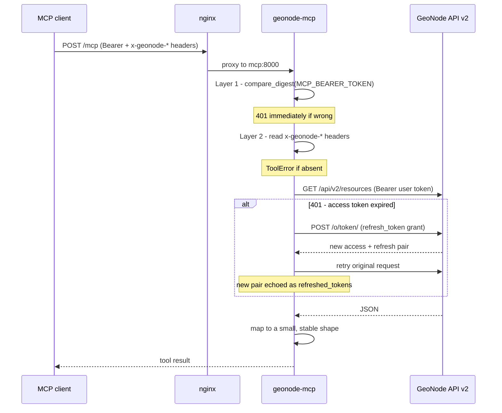
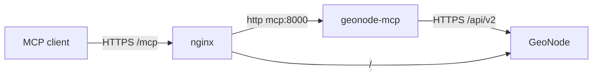

# Architecture

How `geonode-mcp` is built, and why it is built this way. For installation see
[setup.md](setup.md).

## Design goal

Expose GeoNode to an AI assistant **without touching GeoNode**.

That constraint drove everything else. A Django app living inside GeoNode would
have been easier in places - direct ORM access, no token juggling - but it
would have tied the integration to one GeoNode version, one deployment, one
upgrade schedule. Every site wanting it would need to modify their stack.

So this is a standalone service that speaks to GeoNode the same way any other
API consumer does: **REST API v2 over HTTPS, authenticated with OAuth2**.

What that buys:

- No GeoNode fork, no patched templates, no migrations.
- Upgrade GeoNode without touching this; upgrade this without touching GeoNode.
- Works against a GeoNode you do not administer, as long as you have an account.
- The blast radius of a bug here stops at this process.

What it costs:

- Only what the v2 API exposes is reachable. No ORM shortcuts.
- Every call is a network hop, with a token to manage.
- Bulk operations are N API calls, not one query.

For this use case that trade is clearly worth it. An assistant issuing a handful
of calls per conversation does not need ORM-level throughput.

> **On the term "plugin":** this is not a Django plugin and does not install
> into GeoNode. It is a companion service. The distinction matters when reading
> the code - there is no `INSTALLED_APPS` entry anywhere.

## The two-layer auth model

The central design decision. Two independent checks, both mandatory, answering
two different questions:

| | Question | Mechanism | Scope |
|---|---|---|---|
| **Layer 1** | Is this deployment allowed to talk to me at all? | Static shared bearer token | Whole server |
| **Layer 2** | Who is asking, and what may *they* do? | Per-user GeoNode OAuth2 token | Per request |

### Layer 1: the transport gate

`src/geonode_mcp/auth.py`. A `TokenVerifier` comparing the presented bearer
against `MCP_BEARER_TOKEN` with `hmac.compare_digest` (constant-time, so the
comparison does not leak the token one byte at a time through timing).

It runs inside FastMCP's auth hook, so it fires **before any tool code and
before any GeoNode call**. An unauthenticated request costs one string compare.

This layer deliberately carries **no identity**. It is a lock on the door, not a
name badge. Everyone shares one key, which is exactly why it cannot be the only
layer - and why it is a known weakness at scale (see
[Limitations](../README.md#limitations)).

### Layer 2: per-user GeoNode identity

`src/geonode_mcp/geonode_tokens.py`. Each request must carry:

```
x-geonode-access-token:  <the caller's GeoNode access token>
x-geonode-refresh-token: <the caller's GeoNode refresh token>
```

Every tool starts by calling `tokens_from_request()`, which pulls these off the
live HTTP request. Missing either one raises a `ToolError` telling the user to
run `geonode-mcp-setup` - the error we return before any GeoNode traffic
happens.

The tokens are then attached to a `GeoNodeClient` as `Authorization: Bearer`,
so **GeoNode itself decides what the caller may see and do**. There is no
permission logic in this codebase, and that is on purpose: reimplementing
GeoNode's ACL model would guarantee it drifts out of sync. GeoNode already
knows the answer, so we ask it.

The consequence worth stating plainly: **the server has no standing access to
anything.** It holds no credentials of its own. With no caller token it can do
nothing at all. A compromised MCP process leaks the transport token and whatever
tokens are in flight - not the catalogue.

## Request lifecycle



## Token refresh and rotation

`src/geonode_mcp/client.py`. `GeoNodeClient.request()` sends the call; on `401`
it performs one refresh-grant, notifies via `on_token_refreshed`, and retries
**once**. One retry only - a second 401 after a fresh token means something is
genuinely wrong, and looping would just hammer the auth endpoint.

The subtle part: django-oauth-toolkit **rotates** refresh tokens. The old
refresh token dies the moment it is used. But the client that called us is
holding that now-dead token in its config.

So every tool echoes the new pair back in its result:

```json
{
  "total": 3,
  "resources": [...],
  "refreshed_tokens": {
    "access_token": "...",
    "refresh_token": "..."
  }
}
```

The field appears **only** when a refresh happened. A client that persists it
keeps working indefinitely; a client that ignores it will keep functioning until
the access token expires again, then fail with a dead refresh token and need
`geonode-mcp-setup` re-run.

This is the least elegant part of the design. It is a consequence of MCP having
no channel for a server to push updated credentials back to a client - the
result payload is the only route available. Documented rather than hidden.

## Obtaining the first token pair

`setup_cli.py` + `oauth.py`. A one-time OAuth2 **password grant**: username and
password are posted to GeoNode's `/o/token/`, and the returned pair is written
to `~/.geonode-mcp/tokens.json` at mode `0600`. The password is held in a local
variable for the duration of one HTTP request and never written anywhere.

`password_grant()` refuses outright if `base_url` is not `https://`. Posting an
LDAP password over plaintext is not a warning-level mistake, so it is not a
warning - it is an exception.

Password grant is deprecated in OAuth2 circles, and rightly so. It is used here
because it is the only flow that works without a browser round-trip, which
matters for a CLI. Sites using SSO should replace it with authorization-code
plus PKCE; the rest of the system is indifferent to how the tokens were minted.

## Module layout

| Module | Responsibility |
|---|---|
| `server.py` | Entrypoint. Builds the `FastMCP` instance, registers all tools. |
| `auth.py` | Layer 1 - the static bearer verifier. |
| `geonode_config.py` | Server-wide config from env: base URL, OAuth client id. Not secrets. |
| `geonode_tokens.py` | Layer 2 - pulls the caller's tokens off request headers. |
| `oauth.py` | Password grant and refresh grant against `/o/token/`. |
| `token_store.py` | Local token file read/write for the setup CLI. |
| `client.py` | Authenticated HTTP client with refresh-once-on-401. |
| `setup_cli.py` | The `geonode-mcp-setup` command. |
| `geonode_call.py` | `call_geonode()` - the one request envelope every tool shares. |
| `search.py` `metadata.py` `permissions.py` `upload.py` `resources.py` `keywords.py` `maps.py` `users.py` | The thirteen tools. |

Every tool goes through `call_geonode()`, which owns the parts that are identical
for all of them:

1. `tokens_from_request()` - Layer 2.
2. Build a `GeoNodeClient`, collecting any refresh.
3. Call GeoNode; translate an unexpected status into a `ToolError` carrying the
   status and body, and an `OAuthError` into a clear "token rejected" message.
4. Decode the body - or `None`, for a 204 with nothing in it.
5. Hand it to the tool's own `map_result`, which is the only part that differs.
6. Attach `refreshed_tokens` if a refresh occurred.

So a new tool is one `call_geonode()` call plus a mapping function, and a thin
`@server.tool` wrapper whose docstring is what the model reads.

### Why responses are mapped, not passed through

GeoNode resource objects are large and carry a lot the assistant does not need.
Each tool maps to a small explicit dict - `pk`, `title`, `resource_type`,
`state`, `owner`, `detail_url` for search.

Three reasons:

- **Token cost.** Raw GeoNode JSON is enormous. Assistant context is finite.
- **A stable contract.** GeoNode can add or move fields; the mapping absorbs it.
- **Least disclosure.** Only what a tool needs crosses the boundary.

The docstring on each `@server.tool` wrapper is not decoration - it is the
description the model uses to decide when to call the tool. Vague docstrings
produce wrong tool choices, so they are written for that reader.

## Deployment topology



The service listens on `0.0.0.0:8000` inside its container and is **not**
published to the host. Reaching it goes through the reverse proxy, so it
inherits the TLS termination already in place for GeoNode.

Two proxy details that are easy to get wrong, both learned the hard way:

- **No trailing slash on the nginx location.** FastMCP mounts its endpoint at
  `/mcp`. With `location /mcp/`, nginx auto-301s `/mcp` to `/mcp/` while FastMCP
  307s `/mcp/` back to `/mcp`, and the two redirect at each other forever. Use
  `location /mcp`.
- **Do not put the config on a named volume.** Docker seeds a named volume from
  the image only when the volume is first created; afterwards it masks the
  image, and config baked into a newer image silently never arrives.

## Testing

61 tests, fully offline - `respx` mocks every GeoNode HTTP interaction, so the
suite needs no GeoNode and runs in well under a second.

Each layer is tested at its seam:

- `test_auth.py` - correct token accepted, wrong token rejected, missing env var raises.
- `test_oauth.py` - grant shapes, error propagation, the https-only refusal.
- `test_client.py` - the 401-refresh-retry path, and that it retries only once.
- `test_search.py` / `test_metadata.py` / `test_permissions.py` / `test_upload.py` -
  per tool: happy path, response mapping, missing-token rejection, error translation.
- `test_users.py` - the field-filter query, the fallback to the next field, and
  that ownership transfer sends a top-level `owner` username (in `test_permissions.py`).
- `test_setup_cli.py` - token file written, correct mode, password not persisted.
- `test_lifecycle.py` - one session walking upload, poll, metadata edit, map
  creation and both deletes, asserting every GeoNode call along the way. It is
  the regression net for the shapes that only a real instance revealed.

What the suite does **not** cover, and where manual verification is still
required: real GeoNode API compatibility, the reverse proxy path, and whether
GeoNode's permission model behaves as expected for a given user. Mocks confirm
we send what we intend to send - not that GeoNode agrees.

## Rejected alternatives

**A Django app inside GeoNode.** Direct ORM access and no token plumbing, but
version-locked to GeoNode and requires every adopting site to modify their
deployment. Rejected against the core design goal.

**A service account with admin rights.** Much simpler - one token, no header
plumbing, no refresh dance. Rejected outright: it would make every user
effectively an admin, since the assistant would act with admin rights whoever
was asking. The per-user token model exists precisely to prevent that.

**Caching GeoNode responses.** Tempting for search. Rejected for now because
cached results outlive permission changes: a dataset unshared a minute ago
would still surface. Correctness beats latency at this scale.
